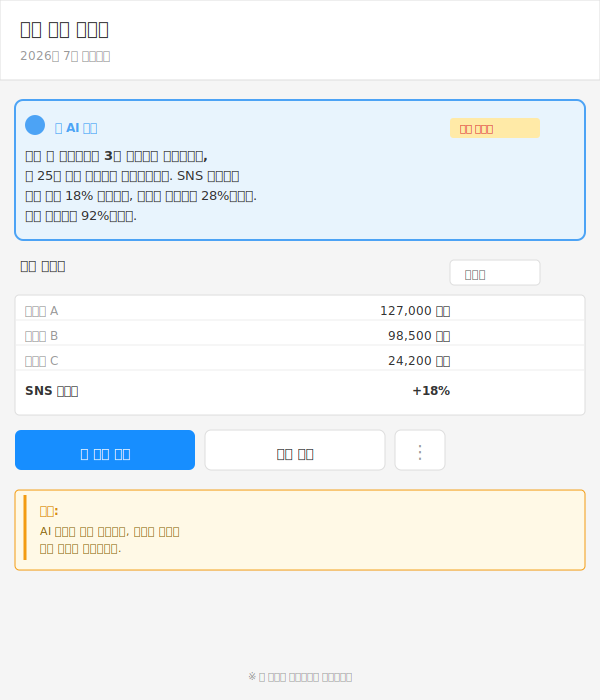
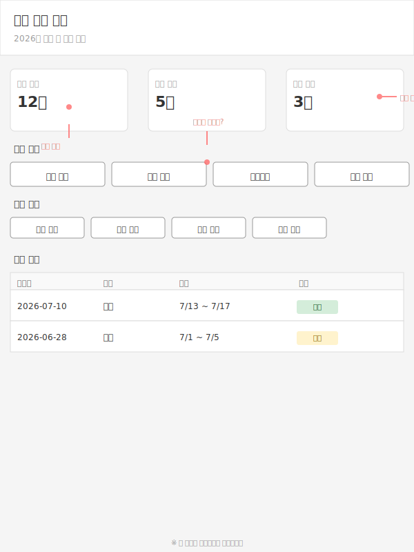

# Clean Eye 🔍

한국 직장인 페르소나로 화면을 Think-Aloud 평가하는 Claude 스킬

## 왜 만들었나

시안을 그리다 보면 깊게 빠져서 벗어나오기 어려울 때가 있어요.  
내가 놓친 게 뭘까? 일반 직장인이 이 화면을 처음 보면 어떻게 이해할까?

그럴 때 필요한 게 **"3자의 깨끗한 눈"**입니다.

### 일반 AI와의 차이

일반 AI에 물어봐도 되지만, 문제가 있어요:
- **메모리 오염** — 업무하면서 AI를 많이 쓰면 학습 데이터가 쌓임
- **한국인 회사원 특화** — 일반적인 영어권 관점이 아니라, 한국 직장인 입장에서 보는 게 다름

### Think-Aloud 기법

HCI(인간-컴퓨터 상호작용) 석사하면서 유저 리서치에 많이 썼던 **Think-Aloud** 기법을 도입했습니다.

사람들이 화면을 처음 봤을 때:
- 👀 **관찰** — 뭐가 가장 먼저 눈에 띄나?
- 💭 **생각** — 그게 뭘 하는 건지 어떻게 추측하나?
- ➡️ **행동** — 다음에 뭘 할 것 같나?
- 📝 **요약** — 한 줄로 정리하면?

## 뭔가

**Clean Eye**는 NVIDIA의 합성 페르소나 데이터셋 [Nemotron-Personas-Korea](https://huggingface.co/nvidia/Nemotron-Personas-Korea)를 기반으로 합니다.

### 페르소나 특징

- **연령**: 20~60세
- **직군**: 일반 회사원 (사무원, 관리자, 은행원, HR 등)
- **IT 친숙도**: 높음~낮음 다양
- **전문가 제외**: 개발자, 디자이너, PM 같은 화면 리터러시 높은 직군은 제외

즉, "비전문가 입장에서 이 화면 이해할까?"를 확인하는 거예요.

### 평가 방식

사용자가 제공한 화면 캡처(단일 또는 연속 흐름)를 5명 내외의 페르소나가 처음 보는 관점에서 Think-Aloud 방식으로 평가합니다.

**결과**:
- 각 페르소나별 반응 정리
- 공통으로 걸리는 포인트 찾기
- Top 3 개선 권장사항

## 어떻게 평가하나요

평가는 석사 시절 자주 활용했던, HCI(Human-Computer Interaction) 분야에서 많이 사용하는 Think-Aloud 방식을 참고했습니다.

페르소나는 화면을 보면서 자연스럽게 이런 순서로 생각합니다.

👀 **가장 먼저 무엇이 보이는지?**  
화면에서 눈에 가장 먼저 들어오는 요소들을 관찰합니다.

💭 **이 화면이 무엇을 하는 곳이라고 이해하는지?**  
그 화면의 목적과 기능을 어떻게 해석하는지 봅니다.

👉 **다음에 무엇을 누를 것 같은지?**  
화면을 이해한 후 실제로 어떤 행동을 취할 것 같은지 예상합니다.

📝 **마지막으로 화면을 어떻게 정리하는지?**  
전체적인 인상과 경험을 한 줄로 요약합니다.

**핵심**: 단순히 "좋다, 나쁘다"보다 **왜 그렇게 생각했는지를 보는 데 초점**을 맞췄습니다. 이를 통해 설계자가 놓친 부분을 발견할 수 있습니다.

## 어떻게 쓰나

### 설치

```bash
# 1. 이 저장소 클론
git clone https://github.com/[your-username]/clean-eye.git
cd clean-eye

# 2. Python 환경 준비 (선택)
# 페르소나 데이터를 HuggingFace에서 직접 다운로드하려면
python -m venv venv
source venv/bin/activate  # macOS/Linux
# or
venv\Scripts\activate  # Windows
```

### 기본 사용법

```bash
# 1. 평가할 화면 캡처 준비 (PNG, JPG)
# → 단일 이미지 또는 연속된 스크린샷들

# 2. Claude에 Clean Eye 스킬 적용
# Claude Code에서 /clean-eye-skill 명령 사용

# 3. 화면 업로드 및 평가 요청
# "이 화면을 Clean Eye로 평가해줘"
```

### 데이터 준비

이 저장소에는 `data/Sample Personas.json`이 포함되어 있어서 바로 테스트할 수 있습니다.

더 많은 페르소나가 필요하면:
- `data/README.md` 참고
- HuggingFace에서 직접 다운로드 가능

## 실제 예시

### 📊 사례 1: AI 자동 요약 보고서

**전문가 관점**: "AI가 핵심을 잘 요약했다"  
**일반인 관점**: "이 요약이 맞나? 내가 뭘 해야 하는 거야?"



**Common Issues**:
- "이 요약 사용"의 정확한 동작이 불명확
- AI 신뢰도 표시 부재
- 단계별 프로세스 설명 부족

---

### 🗓️ 사례 2: 회사 휴가 신청 시스템

**전문가 관점**: "정보 구조 좋고, 버튼 배치 논리적이네"  
**일반인 관점**: "근데... 휴가를 신청하려면 어디를 누르는 거야?"



**Common Issues**:
- 주요 CTA(Call-to-Action) 위계가 불명확
- 버튼이 너무 많아서 시행착오 발생
- 정보 카드에 설명 부재

## 주의사항

### 이건 실제 사용자 테스트가 아닙니다

Clean Eye는 **합성 페르소나 기반 정성적 시뮬레이션**입니다.

실제 사용성 검증을 위해서는:
- 실제 사용자와 Think-Aloud 테스트 진행
- A/B 테스트
- 정량 데이터 수집

이 도구는 그 전에 **빠른 피드백**을 얻기 위한 것입니다.

### 데이터 출처

- NVIDIA Nemotron-Personas-Korea (CC BY 4.0)
- PII 없음 (합성 데이터)

## 참고

- `SKILL.md` — 상세 스펙 및 워크플로우
- `data/README.md` — 페르소나 데이터 설명
- `references/` — 평가 가이드, 필터, 스키마

## License

CC BY 4.0 — [LICENSE.md](./LICENSE.md) 참고

---

**Questions or feedback?** 이 스킬을 더 좋게 만들 아이디어가 있으면 알려주세요.
